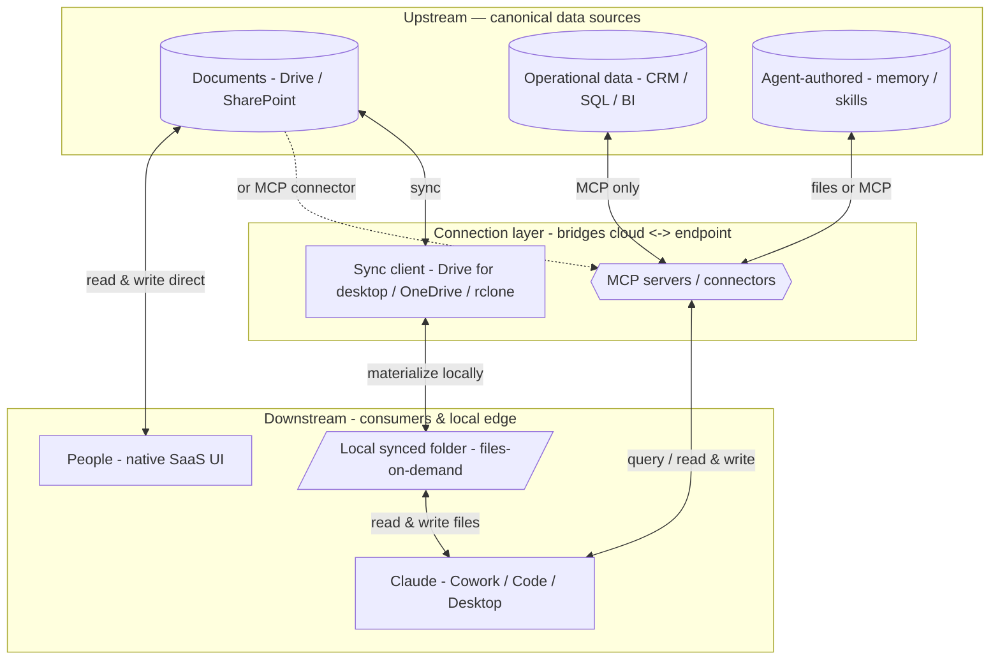

# Centralized Cross-Platform Knowledge for AI — A Comprehensive Guide (Claude-first)

> Companion to *Centralized Knowledge for AI (Claude-first)* in this folder. That note is the working
> draft; this is the consolidated, reorganized reference. Researched **Claude-first** — Claude is the
> primary consumer (via Cowork, Claude Code, and the chat app); an external agent runtime is an
> optional secondary consumer. Facts current as of mid-2026.

---

## 1. The problem and the goal

Give AI **one shared source of truth** for a company's knowledge — one that every person *and* every
AI tool can **read and, where the path allows, write** — across platforms. No copy-pasting documents
into chats, no stale duplicates, no per-tool silos.

Three families of knowledge:

| Pillar | Kind | What it is | Canonical store |
|--------|------|-----------|-----------------|
| **1 — Company sources** | **Documents** | Files people edit directly | Google Drive, SharePoint, git |
| | **Operational data** | Live / structured business data | CRM, SQL databases, BI (Qlik) |
| **2 — Agent-authored** | **Conversation memory** *(episodic)* | Exchanges between people and the AI | claude.ai: server-managed · Claude Code / Cowork: local files |
| | **Project memory** *(scoped)* | Context scoped to a workspace | claude.ai Projects (server-managed, siloed) |
| | **Learned facts** *(semantic)* | Facts the AI distills and reuses | files (CLAUDE.md + notes), MCP memory server, or API memory tool |
| | **Skills & workflows** *(procedural)* | Reusable *how-to* | files (SKILL.md + scripts) in synced folder / git |
| | **Artifacts / outputs** | The AI's work products | once saved, *become Documents* |

**Write is the feature that turns a consumer into a participant** — read-only observes; write acts. But
write is *not* a universal baseline: it's gated, per-connector, and often the exception today. Design
**read-first**, and let write *elevate* the system wherever the path allows.

---

## 2. The enterprise surfaces — where Claude actually runs

The design depends on *which* Claude product employees use, because they store data very differently.

| Surface | Who it's for | Where it runs / stores | Memory model |
|---------|--------------|------------------------|--------------|
| **Claude Cowork** | non-developer employees (the enterprise default; GA on paid plans, launched Jan 2026) | **local desktop agent** — local sandbox VM, read/write local files in connected folders, MCP connectors for live systems | **file-based** (project-root `CLAUDE.md` + auto-memory), local, project-scoped |
| **Claude Code** | developers (CLI) | local agent; files + memory + transcripts under `~/.claude/` | **file-based** (`CLAUDE.md` + auto-memory + `*.jsonl` transcripts), local |
| **claude.ai chat** | lightweight Q&A | Anthropic's cloud | **server-managed**, siloed (chat memory auto-synthesized ~24h; per-project memory) |

> **The key fact:** the two surfaces that do real agentic work over company data — **Cowork
> (employees)** and **Claude Code (developers)** — are *local-file + MCP* agents. The server-managed
> chat app is the exception. So the model below isn't a developer niche; it is **how the mainstream
> enterprise product already works.** Cowork *natively implements* the connection model in §4.

---

## 3. First principles

Strip the products away and the design falls out of a few irreducible truths. Each forces the next;
together they *generate* the connection model in §4 — those aren't choices, they're consequences.

1. **The model is stateless — knowledge only exists in-context or one fetch away.** An LLM keeps
   nothing between calls. → Every design reduces to two moves: **put bytes in context**, or **give a
   way to fetch them.** Everything else is plumbing.

2. **Connect to the source; never copy it.** A copy is a second truth the instant it's made, and it
   drifts. → Keep the canonical copy in the **source system** and reach in. *(This is **Axis 1**.)*

3. **There are only three physical ways one program reaches another's data: as a file, as a call, or
   through a UI.** Local bytes (filesystem), remote bytes over a protocol (tool/MCP call), or — when
   neither exists — driving the human interface (computer use). The set is **exhaustive**. *(This is
   **Axis 2**.)*

4. **Read is consumption; write is participation.** → Write-back is **the feature** that earns
   participation; pursue it where the path allows, but design read-first — it's not a baseline you can
   assume.

5. **Capability is bounded by the source's own permissions, and risk scales with what you write to.**
   → Permission inheritance + least privilege + draft-before-execute. Governance is *derived from
   where the write lands*, not bolted on.

6. **Context is finite and rivalrous.** Every token loaded competes for attention and cost. →
   *Load-it-all* vs *fetch-on-demand* is an economics decision that recurs everywhere (documents,
   memory, schemas). "Fits" ≠ "should load."

7. **Nothing the AI authors is a special primitive — memory, skills, workflows, and artifacts are all
   just knowledge it produced.** → They ride the same file-or-call mechanisms: skills and workflows
   *are files*; an artifact, once saved, *becomes a document*.

8. **The substrate is one loop; protocols are packaging.** Reaching a live system is always
   `request → execute → result`. MCP, raw function calling, and built-in tools are packagings of it. →
   Don't mistake a standard (MCP) for the mechanism (the call).

---

## 4. The connection model — two axes, one closed taxonomy

Two **axes** decide which mechanisms belong in a single-source-of-truth design:

- **Axis 1 — where the canonical copy lives:** the **source system** (the truth) or a **copy in
  Anthropic's managed store** (the "stale duplicate / silo" we reject).
- **Axis 2 — how Claude touches the source:** as **local files**, as a **live tool call**, or through
  a **GUI**.

The full landscape:

| Mechanism | How Claude touches it | Canonical copy | R/W | Role |
|-----------|-----------------------|----------------|-----|------|
| **Synced folder** | local files (sync client mirrors cloud) | **source system** (folder is an edge mirror) | R/W | ✅ **primary** — documents + file memory |
| **MCP tool calls** | live tool call (standardized tool-use loop) | **source system** | R/W | ✅ **primary** — operational data + structured memory |
| **Computer / browser use** | GUI automation (screenshots, click/type) | **source system**, via its UI | R/W | ⚠️ **fallback** — no file *and* no API |
| Raw function calling | live tool call (hand-defined) | source system | R/W | = MCP without the protocol |
| Files API | passive upload, by `file_id` | **Anthropic store** (copy) | R-in only | ❌ copy, no write-back, not ZDR |
| Projects / managed RAG | passive upload + hosted retrieval | **Anthropic store** (copy) | Read-only | ❌ copy/silo — the anti-pattern |
| Built-in web search / fetch | hosted live tool | public web | Read-only | ❌ not *company* knowledge |

**Narrowing rule:** keep the canonical copy in the source (Axis 1), then pick the touch-mechanism the
source supports (Axis 2). That leaves **two read/write mechanisms that carry the design** — the
**synced folder** and **MCP tool calls** — plus **computer/browser use** as the fallback when a system
exposes neither a syncable file nor an API. Everything in the Anthropic-store column is excluded: it
duplicates the source and is read-mostly. *(Excluded is **managed** RAG specifically — self-built RAG
over your own source, exposed via MCP, belongs in the MCP row; see §10.)*

> **MCP is not a separate mechanism from "tool use" — it's a standardized packaging of it.** The
> substrate is the Claude API tool-call loop (`tool_use` → your code runs → `tool_result`); raw
> function calling is the un-standardized form. When this guide says "MCP," read **live tool calls,
> standardized via MCP.**

---

## 5. Layering: upstream → connection → downstream



- The **sync client** (Drive for desktop / OneDrive / rclone) is a **connection-layer** mechanism — it
  bridges the remote cloud store to the local machine.
- The **local synced folder** is **downstream / at the edge** — it physically lives on the same machine
  as the AI. That's *why* it feels local. MCP materializes nothing locally.
- **People are downstream consumers too** — they read/write the same source via the native SaaS UI,
  bypassing the connection layer.

---

## 6. Documents

Claude reads/writes **local files** (the local Filesystem MCP on Desktop, or Claude Code / Cowork — each
write user-approved). Two ways to reach documents:

| Path | Read | Write back | Notes |
|------|------|-----------|-------|
| **MCP connector** (Drive, M365/SharePoint, custom) | ✅ | ⚠️ **read-only for existing docs** — Drive connector can *save new* files but **can't edit existing** Docs/Sheets in place; M365 connector is fully read-only | live, no local copy |
| **Synced local folder** (iCloud model) | ✅ | ✅ **read/write** — edit the local file, sync client uploads it | needs a sync client; conflict + native-format caveats |

**The synced folder is the path that unlocks the write feature** for documents (the connector can't
edit existing docs; a synced folder can).

**Tooling (each creates a local folder):**
- **Google Drive** → Drive for desktop (mirror = full copy, or stream = on-demand).
- **SharePoint / OneDrive** → OneDrive sync client with Files On-Demand.
- **Headless / Linux / cross-provider** → `rclone mount` or `bisync`.

**Caveats:**
1. **Native Google Docs/Sheets/Slides are not real files** in a synced folder — they appear as tiny
   `.gdoc` pointers. Editing their *content* needs the connector/API. Synced folders are strongest for
   **real formats** (Office, PDF, markdown, code, CSV).
2. **Sync conflicts** → "conflicted copy" files; adopt a convention (last-writer, or surface both).
3. **First access = download latency** (placeholder hydration); pin hot files.
4. **Auth is per-machine/user** (sync client or rclone token).

---

## 7. Operational data — MCP only (no filesystem path)

Live and structured, so the **mirror image of documents**: there is **no sync/filesystem path**. The
MCP server *is* the integration. Write is per-connector and inherits the source system's permissions.

| Source | MCP path | Write back |
|--------|----------|-----------|
| **CRM — HubSpot** | official HubSpot connector | ✅ create/update records, log notes/tasks (**no delete**); per-action approval + audit; respects HubSpot permissions |
| **CRM — Salesforce** | `@salesforce/mcp` (60+ tools) | ✅ SOQL + CRUD + bulk, bi-directional |
| **Database — Postgres/SQL** | Postgres MCP Pro (Crystal DBA) | ⚙️ `--access-mode=restricted` (read-only) vs unrestricted (DDL/INSERT/UPDATE) |
| **BI — Qlik** | official Qlik MCP Server | ⚙️ query + load scripts/automation; business glossary; reflects Qlik permissions |

### 7.1 Understand before you act

Structured data is **not self-describing**. A column `cust_st` could be "state" or "status," and the
*meaning* — units, enums, joins, business definitions — lives nowhere in the raw rows. The agent must
**orient before it touches anything**, and the schema alone isn't enough: it needs a **semantic
layer**. Run a **read-first, write-last** flow:

1. **Orient — schema + semantics.** Introspect tables/columns/keys *and* read descriptions: column
   comments, a data dictionary, a **semantic/metrics layer** (dbt Semantic Layer, Cube, LookML) or BI
   business logic (Qlik's business glossary). The semantic layer maps business terms ("active
   customer," "MRR") to concrete columns — that's what turns a schema into *understanding*.
2. **Ground — sample + profile.** Pull a few rows, the distinct values of enum-like columns, null
   rates, min/max. Cheap, and it corrects wrong assumptions before they become wrong queries.
3. **Verify — read-only first.** Write a `SELECT`, run it, sanity-check; `EXPLAIN` for cost. The read
   *is* the comprehension test.
4. **Propose — draft the write.** Form the mutation and `SELECT` the affected rows first (a dry run).
5. **Execute — gated.** Per-action approval, a transaction it can roll back, audit (§11).

Two rules keep it scalable and safe:
- **Progressive disclosure for big schemas.** A 1,000-table warehouse won't fit in context — *search*
  the relevant tables → fetch *their* columns + descriptions → sample → query. Don't dump the catalog.
- **Keep the semantic layer in the source** (P2). Column comments, dbt models, Qlik business logic live
  *with* the data and the MCP server exposes them — not a separate schema doc that drifts.

> Same principle as documents: **understanding is retrieval, not pre-loading.** The read-only verify
> step is the "draft before execute" of *comprehension*.

There is **no iCloud-style mount** for operational data. (A read-only nightly export to CSV/Parquet in
a synced folder can speed heavy analysis, but it's a stale snapshot, not the live system.)

---

## 8. Memory

Memory = what the AI learns and reuses. The design splits by **product**:

- **claude.ai's native memory is server-managed and siloed** (web/desktop chat app). Chat memory
  auto-synthesizes a summary every ~24h; each Project has its own space. It lives *inside* Anthropic's
  servers — you can't point it at a shared store or read it on disk. So it does **not** centralize.
- **Claude Code memory and history are already local files** — `CLAUDE.md` (project / `~/.claude/` /
  org) + **auto-memory** (one markdown note per fact under `~/.claude/projects/<id>/memory/` with a
  `MEMORY.md` index) — *and* raw conversation transcripts (`~/.claude/projects/<id>/*.jsonl`). So even
  episodic history is centralizable.
- **Cowork uses the same local file-based model** — project-root `CLAUDE.md` + auto-memory,
  project-scoped, separate from claude.ai chat memory.

Because the centralizable forms are **files**, the **same two paths as documents apply**.

### 8.1 Three ways to centralize learned memory

| Approach | Mechanism | When |
|----------|-----------|------|
| **File-based (default)** | drop the memory folder into a synced location → versioned, read/write by Claude on any machine | small-to-medium, mostly stable, human readability + zero infra matter |
| **MCP memory server** | Knowledge Graph Memory (JSONL: entities/relations/observations); `mcp-memory-service` supports remote MCP for claude.ai | structured/queryable memory, or large memory, or concurrent writes |
| **API memory tool** | Anthropic's `memory_20250818` + context editing: client-side files the runtime drives (can point at the synced folder); context editing keeps the window lean | when an agent *runtime* authors the memory |

### 8.2 File-based vs MCP — retrieval vs load-into-context

One mechanic drives everything: **file-based is loaded into context** (model sees all of it every
turn); an **MCP memory server is queried on demand** (only results enter context).

| Dimension | File-based (synced folder) | MCP memory server |
|-----------|----------------------------|-------------------|
| **Cost** | whole memory re-sent **every turn** — grows linearly; prompt caching makes a stable prefix ~90% cheaper | tool schemas (fixed) + query **results** only; flat as memory grows |
| **Context** | guaranteed present, but large memory dilutes attention and overflows | stays lean & relevant; scales; risk: a fact missed if not queried |
| **Latency** | zero per-lookup (bigger prefill) | a tool round-trip (+ network if remote) |
| **Infra** | none — just the sync client | a process you run (host, uptime, auth, tunnel) |
| **Concurrency** | conflict-copies possible | single write authority |
| **Transparency** | human-readable, git-friendly | JSONL graph, less human-friendly |

**Decision rule:** use **file-based** while memory is small-to-medium, mostly stable, and readability +
zero infra matter. Switch to the **MCP memory server** once memory grows past what you'd keep
permanently in context, or when it must be structured/queried or shared with concurrent writes.

---

## 9. Agent-authored: skills, workflows, artifacts

What the AI produces is not a special primitive (P7) — it's more knowledge, on the same mechanisms.

- **Skills & workflows are *procedural* knowledge stored as files.** An Agent Skill is a `SKILL.md` +
  scripts; a workflow is a script. They centralize *exactly* like documents and file memory — a synced
  folder or git repo, shared by every person and AI tool. (Skills load via **progressive disclosure**:
  a one-line description first, the full body only when invoked.)
- **Artifacts aren't a separate kind** — persisted, they re-enter pillar 1 as Documents. The AI's
  outputs become the same source-of-truth knowledge people author; left only in claude.ai, they're the
  stale-silo anti-pattern.

---

## 10. Discovery & retrieval — the cross-cutting problem

*Reaching, researching, finding* the right knowledge in a large corpus is the **retrieval** problem.
It cuts across documents *and* memory. The two base mechanisms **fail in opposite ways**:

- **Filesystem structure = agentic search.** The model discovers like a developer: grep/glob, walk the
  tree, open files, refine. Relevance ranking *is* the model's reasoning, done iteratively.
- **RAG = embedding similarity.** Chunk → embed → vector index; embed the query, return top-k (usually
  hybrid vector + BM25 + reranker). Relevance is geometric distance, one shot.

| Dimension | Filesystem structure | RAG (vector retrieval) | Both (progressive disclosure by filename) |
|-----------|----------------------|------------------------|-------------------------------------------|
| **Match type** | lexical + navigational + reasoning | **semantic** | semantic *find* + navigational *read* |
| Synonyms / paraphrase | ✗ must guess the term | ✅ strong | ✅ strong (search step) |
| Exact terms / IDs / code | ✅ strong | ✗ weak unless hybrid | ✅ hybrid + exact read |
| **Freshness** | ✅ instant | ✗ needs re-embedding | ◐ find via index; *read* live |
| **Scale** (10⁵–10⁶) | ✗ degrades | ✅ flat | ✅ narrow then navigate |
| Cost to discover | high (iterative) | low (one lookup) | ◐ few targeted round-trips |
| Transparency / citations | ✅ see every read | ✗ opaque | ✅ named files, re-fetchable |
| Context control (P6) | ◐ reads whole files | ✗ top-k pushed every query | ✅ metadata → section |
| Recall failure | bad terms → miss | not in top-k → invisible | needs *both* to miss |
| Infra | none | pipeline + vector store + reranker | pipeline + vector store + MCP app |
| **Who maintains the index** | **humans + conventions** | **a pipeline** (auto-derived) | **both** |

**The real trade-off is who maintains the index and where it lives** (last row): filesystem structure
pushes indexing onto *humans + conventions* (zero infra, transparent, but costs discipline and can't
bridge semantic gaps); RAG pushes it onto a *pipeline* (bridges semantics, scales, but infra +
staleness + opacity); **both** pays for two indexes to get semantic *locate* + structural *navigate*.
They reinforce each other — good structure makes RAG retrieve better and lets progressive disclosure
return meaningful filenames.

- **Small/medium, curated, you control naming, freshness/audit matter** → **filesystem structure**.
- **Large / unfamiliar / messy, semantic queries, many users** → **RAG**.
- **Large *and* you want transparency, citations, context control** → **both**.

### 10.1 The best interface: progressive disclosure by filename

Don't make the RAG tool dump chunks. Expose a RAG app via MCP that returns **filenames first, content
on demand** — the agent navigates documents like a filesystem (`ls` → `open`), with semantic search
underneath and nothing synced locally:

```
search_documents(query, filters)  → [{ filename, title, snippet, score }]   # find:   names + why, not bodies
get_outline(filename)             → headings / section summaries            # orient: structure of one doc
read_document(filename, section?) → content                                 # commit: only the part needed
```

This is **progressive disclosure** (Anthropic's term: agents "incrementally discover relevant context
through exploration," from "lightweight identifiers … loading full content on demand"). It erases RAG's
weaknesses: results are *filenames* (transparency + citations), it fetches whole sections (no chunking
context-loss), metadata comes first (lean context, P6), and it combines RAG's recall with the
filesystem's precision — while staying a **source-derived index behind MCP** (read live, write-back to
source). **Recommended document-reach pattern at scale.**

### 10.2 When one document is too large

A too-large document is the **corpus problem recursed one level down**: discovery shrinks from *which
file* to *which part of this file*. RAG's default (chop into chunks) discards structure; the better move
is progressive disclosure indexed by the document's **own structure** (sections, pages, sheets).

- **Don't read it whole** — even if it fits, stuffing it dilutes attention (P6). Locate, then slice.
- **Parse to a structure tree, navigate it** — outline → section → sub-section/range; the headings *are*
  the index.
- **Multi-level summaries** for very large docs (doc → section → raw text = hierarchical retrieval).
- **Return locators** (page/section/line) so the agent can cite and re-fetch precisely.

Format decides the tactic:
- **Tabular / spreadsheet / CSV** — don't read as prose; **query it** (SQL or dataframe via code
  execution, or an MCP tool). Big structured data is *operational data* (§7), not a doc to scan.
- **Logs** — filter by time/pattern; never load wholesale.
- **Huge PDF** — parse to sections/pages (OCR if scanned), retrieve by page with citations.
- **Large code file** — grep symbols, read ranges; lean on a symbol index.

---

## 11. Governance & write safety

Write to a system of record is categorically higher-stakes than editing a doc (P5). Gate it:

- **Draft, don't execute, by default** — Anthropic's pattern is to *declare negative space*: emit the
  report or recommendation, but leave the high-stakes write (post the entry, approve the record) to a
  human unless executing it is the explicit job. The draft→execute line is the guardrail.
- **Restricted-by-default** — prefer read-only; open write only where needed (e.g. Postgres
  `--access-mode=restricted`).
- **Permission inheritance** — never exceed the user's native rights in the source system. Enforce it
  at query time for retrieval too (never return rows/chunks the user can't see).
- **Per-action approval + audit** for writes; a governance/DLP control plane for higher tiers.

---

## 12. Summary tables

**By knowledge kind:**

| Knowledge | Canonical store | Claude path | Write today |
|-----------|-----------------|-------------|-------------|
| **Documents** | Drive / SharePoint | MCP connector **or** synced local folder | ✅ via synced folder (connector read-only for existing docs) |
| **Operational data** | CRM / SQL / BI | MCP connector only | ⚙️ per-connector (HubSpot/Salesforce write; Postgres configurable) |
| **Learned memory** | CLAUDE.md + auto-memory | synced folder (default) **or** MCP memory server **or** API memory tool | ✅ by construction |
| **Skills & workflows** | SKILL.md + scripts | synced folder / git | ✅ files, by construction |
| **Artifacts / outputs** | save into Documents | synced folder | ✅ becomes a Document |

**By connection mechanism:** synced folder (files, R/W, primary) · MCP tool calls (live, R/W, primary)
· computer use (GUI, R/W, fallback) · *excluded:* Files API, managed RAG, web tools (copies / read-only
/ not company knowledge).

---

## 13. Big takeaways

1. **One mechanism does most of the work:** a **local synced folder** carries documents, file memory,
   *and* skills/workflows — read/write, like iCloud. MCP covers live operational systems and structured
   memory. Computer use is the rare no-file/no-API fallback.
2. **The connector is read-only for existing docs** → the **synced folder** is how you get write.
3. **Operational data has no filesystem path** — MCP only; **understand before you act** (semantic
   layer + read-first flow), write per-connector and gated.
4. **claude.ai's native memory is siloed; Claude Code's and Cowork's are already local files** — to
   centralize, use files (default), an MCP memory server (large/structured), or the API memory tool.
5. **Discovery = filesystem structure vs RAG vs both** — really *human-maintained index vs
   machine-maintained index*. At scale, **progressive disclosure by filename** combines them; the same
   recursion handles a single too-large document.
6. **Nothing the AI authors is special** — memory, skills, workflows, artifacts are all files or calls;
   artifacts persisted *become* documents.
7. **The enterprise surface already fits** — Cowork and Claude Code are local-file + MCP agents; the
   server-managed chat app is the exception.

---

## References

- [Anthropic — Get started with custom connectors using remote MCP](https://support.claude.com/en/articles/11175166-get-started-with-custom-connectors-using-remote-mcp)
- [Anthropic — Use connectors to extend Claude's capabilities](https://support.claude.com/en/articles/11176164-use-connectors-to-extend-claude-s-capabilities)
- [Anthropic — Use Google Workspace connectors](https://support.claude.com/en/articles/10166901-use-google-workspace-connectors)
- [Anthropic — Enable and use the Microsoft 365 connector](https://support.claude.com/en/articles/12542951-enable-and-use-the-microsoft-365-connector)
- [Anthropic — Build custom connectors via remote MCP servers](https://support.claude.com/en/articles/11503834-build-custom-connectors-via-remote-mcp-servers)
- [Anthropic — Claude Cowork](https://www.anthropic.com/product/claude-cowork)
- [Anthropic — Get started with Claude Cowork](https://support.claude.com/en/articles/13345190-get-started-with-claude-cowork)
- [Anthropic — Getting started with local MCP servers on Claude Desktop](https://support.claude.com/en/articles/10949351-getting-started-with-local-mcp-servers-on-claude-desktop)
- [Anthropic — MCP connector (Claude API)](https://platform.claude.com/docs/en/agents-and-tools/mcp-connector)
- [Anthropic — Tool use overview](https://platform.claude.com/docs/en/agents-and-tools/tool-use/overview)
- [Anthropic — Files API](https://platform.claude.com/docs/en/build-with-claude/files)
- [Anthropic — Retrieval augmented generation (RAG) for projects](https://support.claude.com/en/articles/11473015-retrieval-augmented-generation-rag-for-projects)
- [Anthropic — Introducing Contextual Retrieval](https://www.anthropic.com/news/contextual-retrieval)
- [Anthropic — Effective context engineering for AI agents](https://www.anthropic.com/engineering/effective-context-engineering-for-ai-agents)
- [Anthropic — Equipping agents for the real world with Agent Skills](https://www.anthropic.com/engineering/equipping-agents-for-the-real-world-with-agent-skills)
- [Anthropic — Computer use tool](https://platform.claude.com/docs/en/agents-and-tools/tool-use/computer-use-tool)
- [Anthropic — Claude for Chrome](https://claude.com/blog/claude-for-chrome)
- [Anthropic — Web search tool](https://platform.claude.com/docs/en/agents-and-tools/tool-use/web-search-tool)
- [Anthropic — Web fetch tool](https://platform.claude.com/docs/en/agents-and-tools/tool-use/web-fetch-tool)
- [Google — Use Google Drive for desktop](https://support.google.com/drive/answer/10838124)
- [Google — Stream or mirror your files](https://support.google.com/drive/answer/13401938)
- [Microsoft — Sync SharePoint and Teams files](https://support.microsoft.com/en-us/office/sync-sharepoint-files-and-folders-87a96948-4dd7-43e4-aca1-53f3e18bea9b)
- [Microsoft — SharePoint Files On-Demand](https://learn.microsoft.com/en-us/sharepoint/sharepoint-sync)
- [Eclectic Light — File Provider and cloud services](https://eclecticlight.co/2026/05/09/explainer-file-provider-and-cloud-services/)
- [Microsoft — Build a cloud file sync engine (Cloud Files API)](https://learn.microsoft.com/en-us/windows/win32/cfapi/build-a-cloud-file-sync-engine)
- [rclone — mount](https://rclone.org/commands/rclone_mount/)
- [rclone — Microsoft OneDrive backend](https://rclone.org/onedrive/)
- [HubSpot — Claude connector write access to CRM](https://developers.hubspot.com/changelog/claude-write-access-to-crm)
- [HubSpot — Set up and use the HubSpot connector for Claude](https://knowledge.hubspot.com/integrations/set-up-and-use-the-hubspot-connector-for-claude)
- [Salesforce — DX MCP Server (@salesforce/mcp)](https://github.com/salesforcecli/mcp)
- [Crystal DBA — Postgres MCP Pro](https://github.com/crystaldba/postgres-mcp)
- [Qlik — Connecting the Qlik MCP server](https://help.qlik.com/en-US/cloud-services/Subsystems/Hub/Content/Sense_Hub/QlikMCP/Connecting-Qlik-MCP-server.htm)
- [dbt — dbt Semantic Layer](https://docs.getdbt.com/docs/use-dbt-semantic-layer/dbt-sl)
- [Anthropic — Building agents for financial services](https://www.anthropic.com/news/finance-agents)
- [Anthropic — Use Claude's chat search and memory](https://support.claude.com/en/articles/11817273-use-claude-s-chat-search-and-memory-to-build-on-previous-context)
- [Anthropic — Memory tool](https://platform.claude.com/docs/en/agents-and-tools/tool-use/memory-tool)
- [Anthropic — Context editing](https://platform.claude.com/docs/en/build-with-claude/context-editing)
- [Anthropic — How Claude Code manages memory (CLAUDE.md + auto-memory)](https://code.claude.com/docs/en/memory)
- [Model Context Protocol — Knowledge Graph Memory server](https://github.com/modelcontextprotocol/servers/tree/main/src/memory)
- [mcp-memory-service (PyPI)](https://pypi.org/project/mcp-memory-service/)
