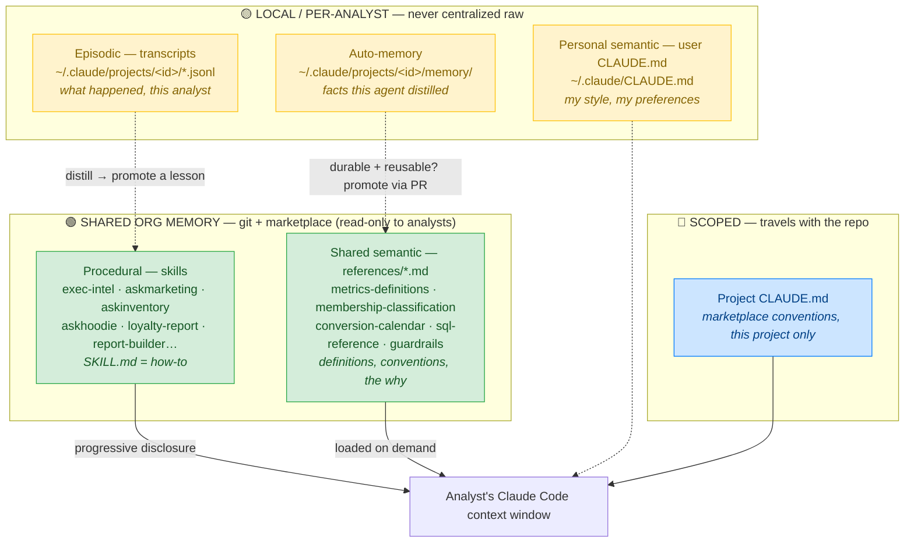
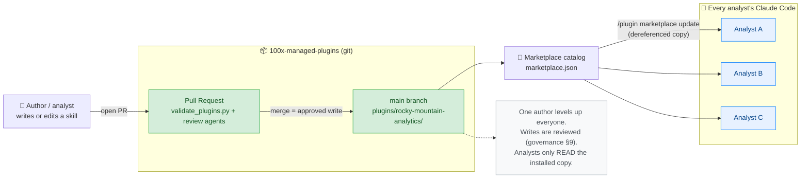
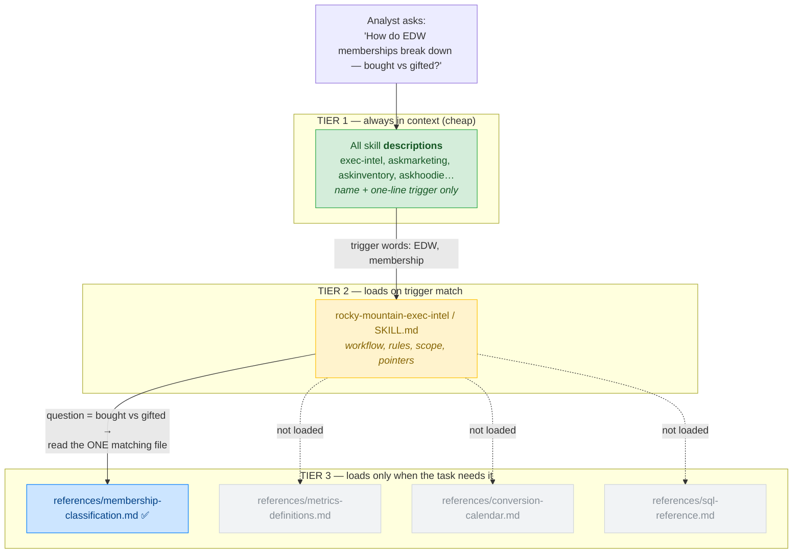
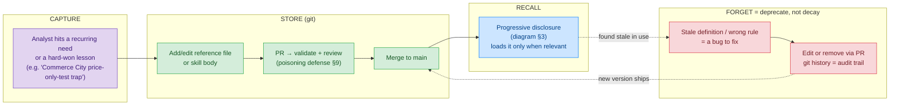
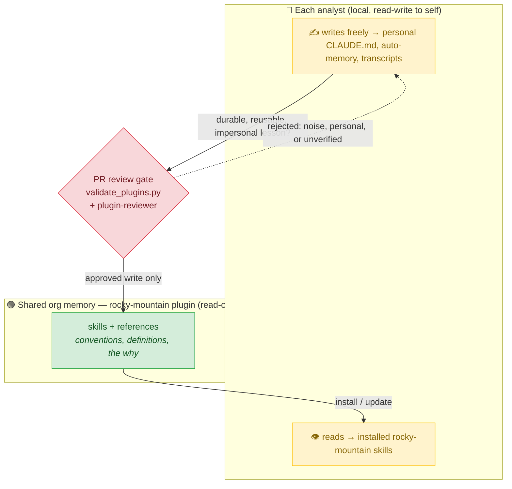
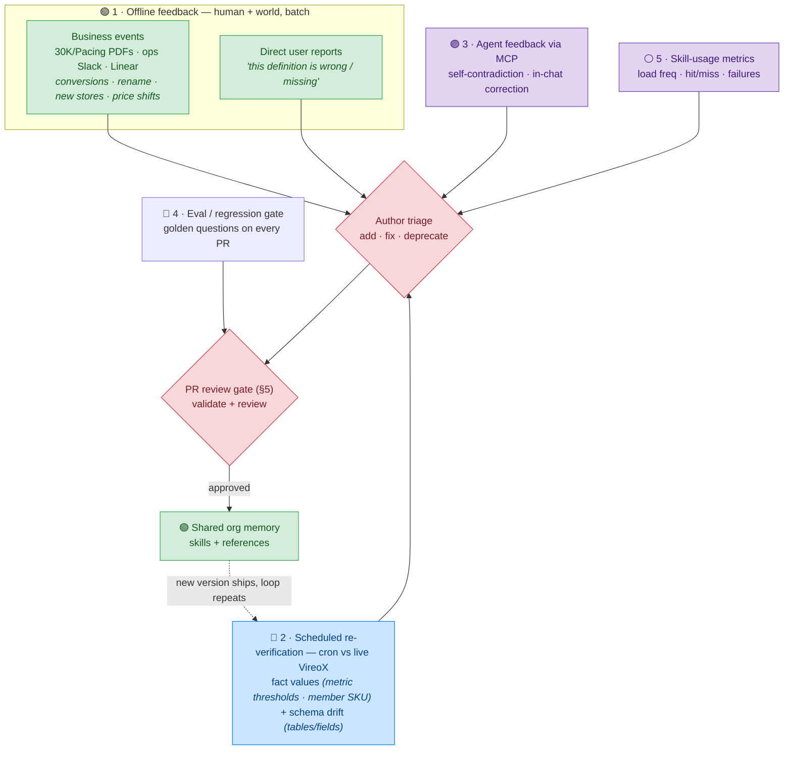

# Rocky Mountain — Shared Org Memory (Skills-Based) Design

> Applies *System Memory for AI — Capture, Store, Recall, Forget* to the
> `rocky-mountain-analytics` plugin. Focus: **shared org memory implemented as skills.**
> The core idea (research §5 tip + §8): a Claude Code **plugin** *is* shared org memory —
> **procedural** knowledge (skills) plus **shared semantic** knowledge (the `references/*.md`
> definitions, conventions, and the *why*), shipped via git → marketplace → every analyst,
> **read-only**, with all writes gated by **PR review**.

---

## 1. The four memory types, mapped to Rocky Mountain

Where each type lives, and what is **shared** vs **local**. Only the plugin (green) is org-shared;
everything else stays on each analyst's machine.



**Read it as:** procedural + shared semantic are the only things worth sharing org-wide
(durable, reusable, impersonal — research §8). Episodic and personal stay local; their *value*
graduates upward by becoming a skill or a documented definition (dotted arrows = the promotion path).

---

## 2. Skills-based shared org memory — the distribution architecture

How one author's knowledge reaches every analyst. Git is the single source of truth; the
marketplace is the delivery channel; each install is a read-only copy.



**Why this is the high-leverage pattern (research §8, table row 1):** procedural memory shared via
git is *free to centralize, already code-reviewed, and impersonal* — lowest risk, highest leverage.
Packaging the shared **semantic** memory (definitions) inside the same skill bundle gives it the
same safe, reviewed, versioned distribution path.

---

## 3. Recall — progressive disclosure (the 3 tiers)

This is *why* skills scale as shared memory: the context window never holds the whole knowledge base.
Only the thin description layer is always present; bodies and reference files load on demand.



**Read it as (research §5):** the description is the *index* (always loaded, like `MEMORY.md`); the
SKILL.md body is the *chapter*; the `references/*.md` are *detail pages* pulled only when the question
matches. Lean context + scales with the glossary = the procedural recall pattern applied to semantic
knowledge. Adding a 20th definition file costs **zero** extra context until it's actually needed.

---

## 4. The memory lifecycle for a shared skill

Capture → Store → Recall → Forget, the way it actually runs for Rocky Mountain. The key move:
a lesson from one analyst's session is **promoted** into the shared skill through a reviewed PR.



**Two things the research stresses (§6):** procedural/shared-semantic memory is **never forgotten
passively** — no time-decay. A wrong rule is a *bug fixed via git*, not clutter that ages out.
And because it's file-based + git, every change is **diffable, reviewable, revertible** — staleness
shows up in review.

---

## 5. Personal vs shared — who can write where (governance)

The safety model: analysts **write only to their own local memory** and **read** the curated shared
skill. Writes to shared memory take the stricter PR path. This is the defense against **memory
poisoning** (research §9 / OWASP ASI06).



**Read it as (research §8 + §9):** *per-user writable stores + a shared read-only store.* The only
way into shared memory is the reviewed PR — which gives you provenance, validation-on-write, and a
revertible audit trail by construction. A poisoned or stale fact can't silently enter the org's memory.

---

## 6. Maintaining shared knowledge

The hard question is not *how* to store shared knowledge, but *how the author knows what to update*.
Several feedback channels feed the author's decision — the diagram below shows them grouped by nature,
and the ranked table that follows scores each by effectiveness. They all converge on the same reviewed
PR gate from §5 — they only change **what** gets queued, never **how** it lands.



**The channels, ranked by effectiveness** for Rocky Mountain — how much real staleness each one
actually catches. Effort is shown separately so a cheap-but-effective channel is easy to spot (the
rollout note after the table balances the two).

| Rank | Channel (id) | What it catches | Effort | Why it ranks here |
|------|--------------|-----------------|--------|-------------------|
| **1** | **Offline feedback** (#5 + #1) | Human + world signals the author collects *outside* the live agent loop: **(a) business events** — banner conversion, the Schwazze→Rocky Mountain rename, a new store, a price-strategy shift, from the weekly 30K/Pacing PDFs, ops Slack, Linear; **(b) direct user reports** — an analyst says a definition is wrong/missing. Protects `conversion-calendar.md`, `report-context-maps.md`, scope, + any reported fact. | Med *(reports: none)* | The **business-event half** is RM's single largest staleness source — *no other channel sees the world change*. The **user-report half** (old standalone #1) is high-trust but partial; folding it in keeps every offline human/world signal on one path. |
| **2** | **Scheduled re-verification** (#4 + #6) | A cron re-checks high-relevance fact *values* against live VireoX (metric thresholds, member SKU/discount logic) **and diffs the VireoX schema** (renamed table / dropped column) before a query collides. Protects `metrics-definitions.md`, `membership-classification.md`, `sql-reference.md`. | Med | The only true fix for the research §7 **hard case** — stale high-relevance facts that still "look right." Proactive, not reactive; one cron covers both the fact values and the SQL *contract*. |
| **3** | **Agent feedback via MCP** (#2) | Agent flags trouble at point-of-use: **self-contradiction** (live VireoX disagrees with a stored fact) or a **user correction** mid-conversation, emitted with provenance. | High | High-value (catches staleness *as it's used*) but **reactive** — only fires when a query happens to hit the bad fact — and needs an MCP write-back path. |
| **4** | **Eval / regression gate** (#10) | A golden-question set in CI; a regression blocks the merge. Protects all skills + references. | Low | Best **ROI** — rides the existing `validate_plugins.py` gate. Catches author-introduced regressions *before* they ship, but not real-world drift. |
| **5** | **Skill-usage metrics** (#3) | Load frequency, trigger hit/miss, failure/over-delegation → fill gaps, fix high-use+high-fail first, retire never-used. | Med–High | Indirect on **correctness** (measures usage, not truth) and needs telemetry that may not exist yet. A prioritization aid, not a staleness detector. |

**How to read the ranking:** effectiveness here = *how much real staleness the channel catches*, not how
cheap it is. **Offline feedback** tops the list on the strength of its **business-event half** — RM's
memory is dominated by time-sensitive business facts and nothing else sees the world change; its
user-report half is high-trust but partial. **Scheduled re-verification** (one cron covering both
fact values and schema drift) catches the VireoX-derived facts that go stale silently. The **eval gate**
ranks high for ROI despite a narrower problem (nearly free). **Skill-usage metrics** ranks last — it
measures usage, not truth, and only after the fact, leaving the research §7 hard case to the channels
above it.

> **Governance still holds (§5; research §9).** None of these channels write to shared memory directly. They
> only **propose** changes into the author's triage; every change still lands through the reviewed PR.
> Channel 2 in particular ingests agent/user content, so its signals must carry **provenance** and be
> treated as untrusted until reviewed — exactly the memory-poisoning defense (OWASP ASI06).

**Rollout order (effectiveness × effort).** The ranking above is pure effectiveness; for *what to build
first*, balance it against effort: start with the **eval gate (#10)** (nearly free — just tests on the
existing `validate_plugins.py` gate), then stand up the **business-event feed** (the #5 half of offline
feedback — reuses the weekly reports already in the pipeline), then **scheduled re-verification with its
schema-drift watcher (#4 + #6)** (both query live VireoX, so they share plumbing). Each one still feeds the same
triage → PR path — they widen *what* you catch, never *how* it lands.

---

## Summary — how the research maps to Rocky Mountain

| Research concept | Rocky Mountain implementation |
|---|---|
| **Procedural memory, shared aggressively** (§8) | The skills themselves (`exec-intel`, `askmarketing`, …) shipped via the marketplace |
| **Shared semantic packaged as a skill** (§5 tip) | The `references/*.md` — metric definitions, membership classification, conversion calendar |
| **Recall = progressive disclosure** (§5) | description (always) → SKILL.md (on trigger) → one reference file (on demand) |
| **Store = files in git** (§4) | `plugins/rocky-mountain-analytics/` version-controlled |
| **Forget = deprecate, not decay** (§6) | Wrong rule = bug fixed via PR; git history is the audit trail |
| **Per-user writable + shared read-only** (§8) | Analysts write local memory; shared writes go through PR |
| **Poisoning defense** (§9) | `validate_plugins.py` + review agents + revertible git history |
| **Episodic stays local, value graduates** (§8) | Transcripts never centralized; a lesson becomes a skill/definition via PR |
| **Maintenance = proactive, not reactive** (§7) | 5 feedback channels ranked by effectiveness — top: offline feedback (business events + user reports), scheduled re-verification (with schema-drift watcher), agent-via-MCP — all feed author triage → PR |
```
