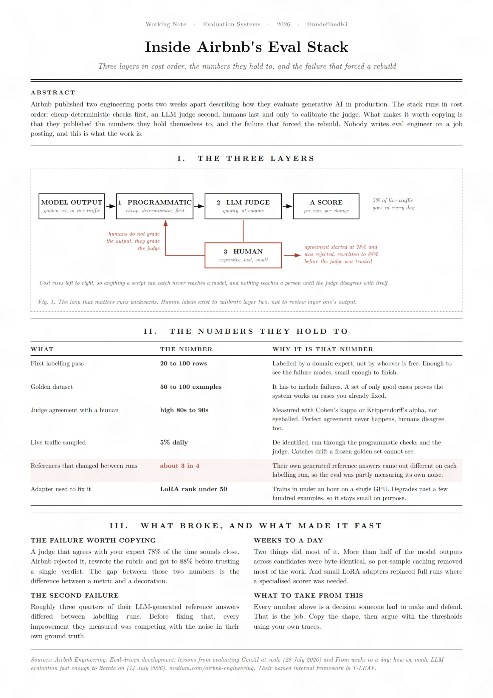

Airbnb just published how they run evals internally, and it reads like a job description for an AI engineer

Three layers. Programmatic checks first, an LLM judge second, humans last and only to calibrate the judge.

The numbers they work to: golden sets of 50 to 100 examples that have to include failures, judges calibrated to high 80s or 90s agreement with a human, measured with Cohen's kappa. 5% of live traffic sampled every day.

The admission that makes it real: roughly three quarters of their LLM-generated reference answers came out different on every labeling run. Their eval was measuring its own noise.

They got a full cycle from weeks down to a day, mostly by caching identical outputs and training tiny LoRA adapters.

Nobody in a job ad calls this eval engineering, but this is the work. Full breakdown in the article below.

Bookmark 
